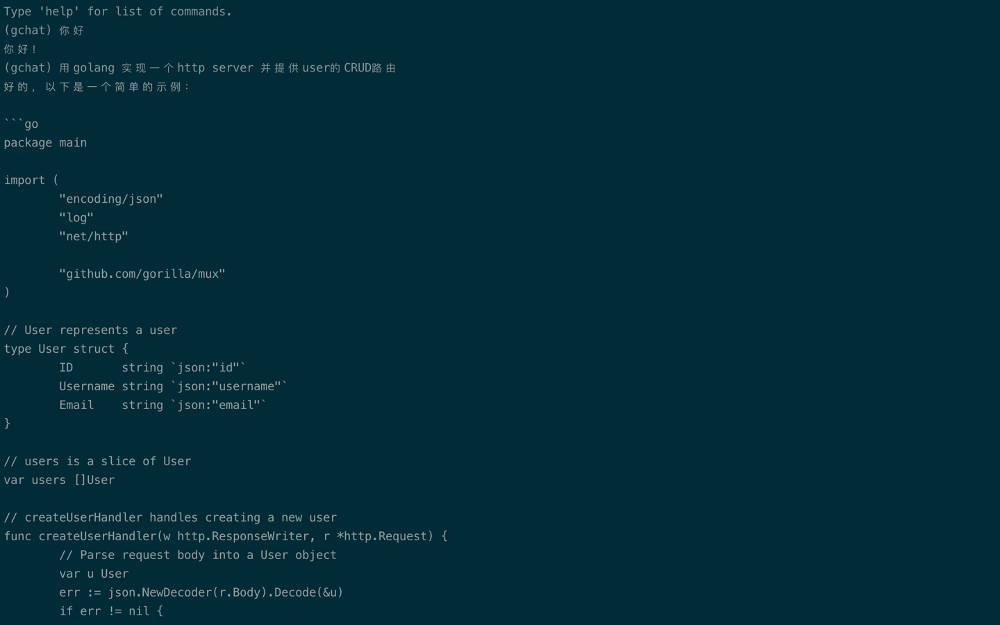

# go-chat-terminal


## 介绍

一个终端的ChatGPT使用工具

```shell
`gchat 是一个终端连接Chat GPT 的聊天工具，可以在终端完成与Chat GPT的对话，通过命令 gchat start 即可进入对话，更多功能和在进入对话后使用help 命令获取更多的信息`

Usage:
  gchat [command]

Available Commands:
  completion  Generate the autocompletion script for the specified shell
  help        Help about any command
  start       启动一个与ChatGPT的对话

Flags:
  -h, --help   help for gchat

Use "gchat [command] --help" for more information about a command.

```

### 命令 

**start**

```shell
启动一个与ChatGPT的对话,默认会监听8888端口，可以通过 port来指定启动端口，
同时关于OpenAI Key, 你可以通过key 来指定，或者添加环境变量GCHAT_KEY来进行指定

Usage:
  gchat start [flags]
  gchat start [command]

Available Commands:
  trans       翻译源码

Flags:
  -h, --help         help for start
  -k, --key string   关于OpenAI Key, 你可以通过key 来指定，或者添加环境变量GCHAT_KEY来进行指定
  -p, --port int     grpc listening port (default 8888)

Use "gchat start [command] --help" for more information about a command.

```




**start trans**

```shell
源码翻译

Usage:
  gchat start trans [flags]

Flags:
  -h, --help            help for trans
  -i, --input string    指定一个代码文件
  -o, --output string   指定输出到某个文件

Global Flags:
  -k, --key string   关于OpenAI Key, 你可以通过key 来指定，或者添加环境变量GCHAT_KEY来进行指定

```

## 本地启动
1. 将代码拉取到本地


2. 使用buf或protoc将proto文件生成

`buf generate`

3. 设置环境变量

```shell
export GCHAT_KEY= "XXXXXX"

// 需要配置代理则需要导入环境变量
export http_proxy="xxx"
export https_proxy="xxx"
```
